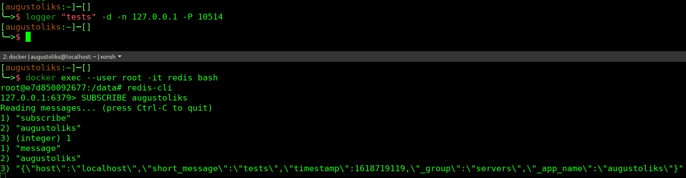

[](https://pkg.go.dev/github.com/augustoliks/gomprog)
[](https://goreportcard.com/report/github.com/augustoliks/gomprog)
[](https://www.codacy.com/gh/augustoliks/gomprog/dashboard?utm_source=github.com&amp;utm_medium=referral&amp;utm_content=augustoliks/gomprog&amp;utm_campaign=Badge_Grade)
[](https://github.com/augustoliks/gomprog/actions/workflows/test.yml)
[](https://github.com/augustoliks/gomprog/actions/workflows/releaser.yml)

<!-- [](https://codecov.io/gh/augustoliks/gomprog) -->

# gomprog

Rsyslog omprog plugin, created to forward logs to Redis instance. Plugin
writted in Golang.

## How install

- Install:

```shell
curl https://raw.githubusercontent.com/augustoliks/gomprog/main/scripts/install.sh | sudo bash
```

- Uninstall:

```shell
curl https://raw.githubusercontent.com/augustoliks/gomprog/main/scripts/uninstall.sh | sudo bash
```

## Rsyslog Config

Configure file created for **rsyslog** in version **8.2010.0-1**

```shell
# Incoming log from udp syslog
module(
  load="imudp"
)

# Import omprog, needded for fork gomprog binary
module(
  load="omprog"
)

# Define log template formatter GELF, compatible with gomprog handler
template(name="gelf" type="list") {
  constant(value="{\"_app_name\":\"")       property(name="app-name" caseconversion="lower")
  constant(value="\",\"host\":\"")          property(name="$myhostname")
  constant(value="\",\"short_message\":\"") property(name="msg" format="json")
  constant(value="\",\"timestamp\":")       property(name="timegenerated" dateformat="unixtimestamp")
  constant(value=",\"_group\":\"servers\"}\n")
}

# Import omprog, needded for fork gomprog binary
input(
  ruleset="main"
  type="imudp" 
  port="10514"  
)

# Define sub-ruleset to delivery logs, from imudp to gomprog binary (rsyslog omprog)
ruleset(name="main"){
  call gomprog
#  call plugin-foo
#  call ...
#  call plugin-bar
}

# Define sub-ruleset to delivery gomprog binary (rsyslog omprog)
ruleset(name="gomprog"){

  action(
    type="omprog"
    binary="gomprog-redis -n 127.0.0.1:6379 -p redis-password"
    template="gelf"
    action.resumeInterval="5" 
  #  output="/tmp/gomprog-debug.log"
  )

}
```

## Tests

Download project

```shell
git clone https://github.com/augustoliks/gomprog
cd gomprog/
```

Provisioning redis instance

```shell
cd tests/
docker-compose up -d 
```

Configure Rsyslog

```shell
cp packaging/rsyslog.d/30-gomprog-redis.conf /etc/rsyslog.d/30-gomprog-redis.conf
systemctl restart rsyslog 
```

Log to upd using `logger` cli command

```shell
logger -d -n 127.0.0.1 -p 10514 "tests"
```

Access Redis container, subscribe `_app_name` channel

```shell
docker exec --user root -it redis bash                                                                                                           

root@e7d850092677:/data# redis-cli 

127.0.0.1:6379> SUBSCRIBE augustoliks
Reading messages... (press Ctrl-C to quit)
1) "subscribe"
2) "augustoliks"
3) (integer) 1
1) "message"
2) "augustoliks"
3) "{\"host\":\"localhost\",\"short_message\":\"tests\",\"timestamp\":1618719119,\"_group\":\"servers\",\"_app_name\":\"augustoliks\"}"
```

> **note:**
>
> **augustoliks** should be replace with Your Linux Username

Output expected

[](./docs/image/example.jpg)

## References

- https://petersouter.xyz/testing-and-mocking-stdin-in-golang/
- https://github.com/golang-standards/project-layout
