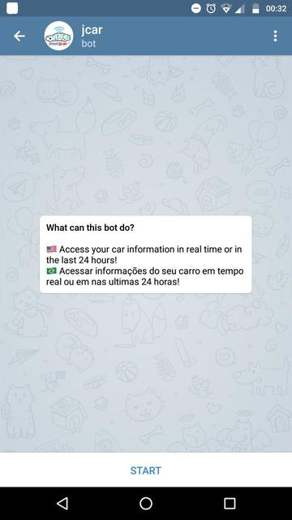
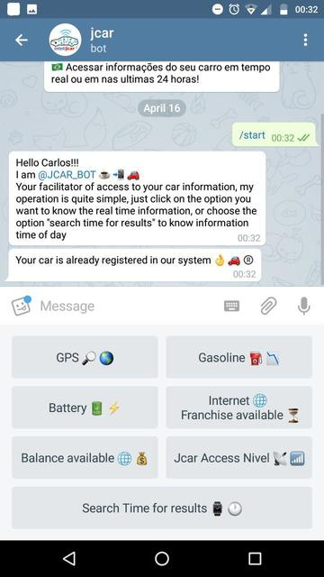
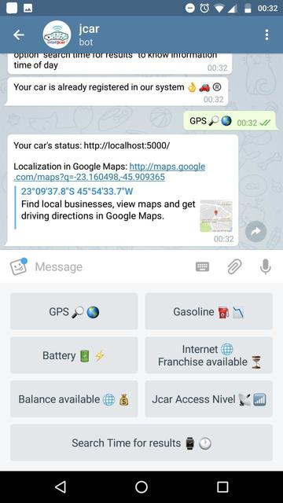
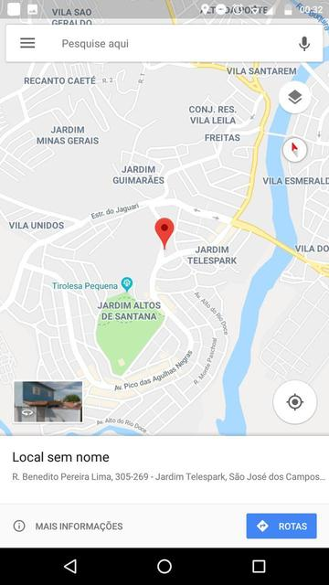
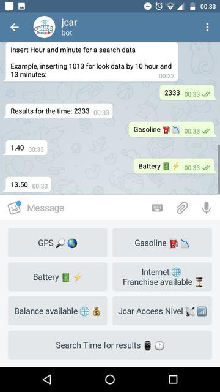
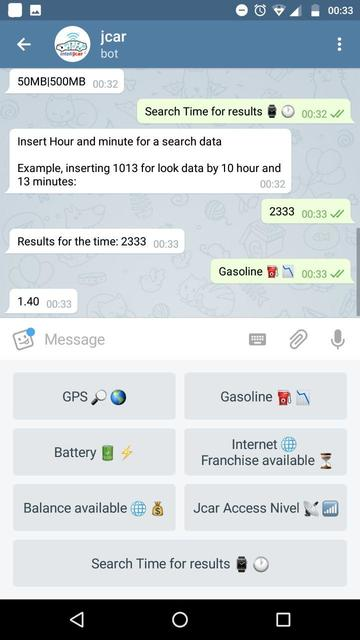
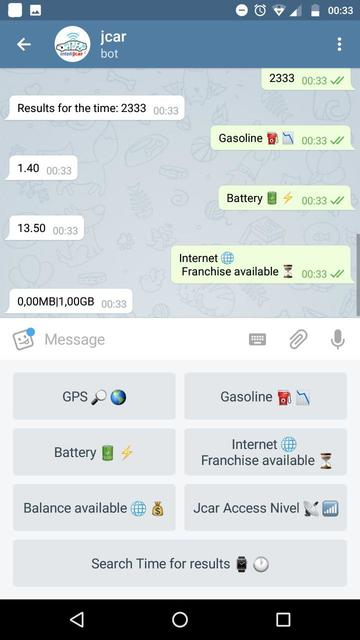
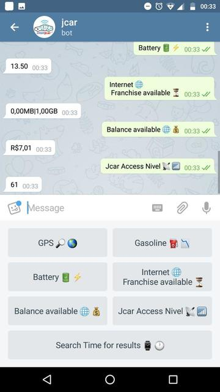
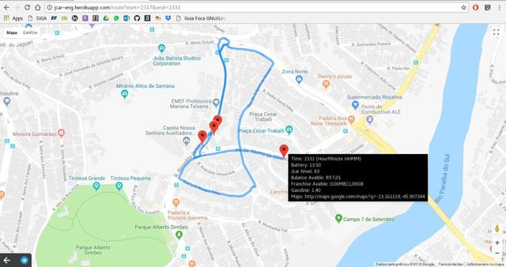
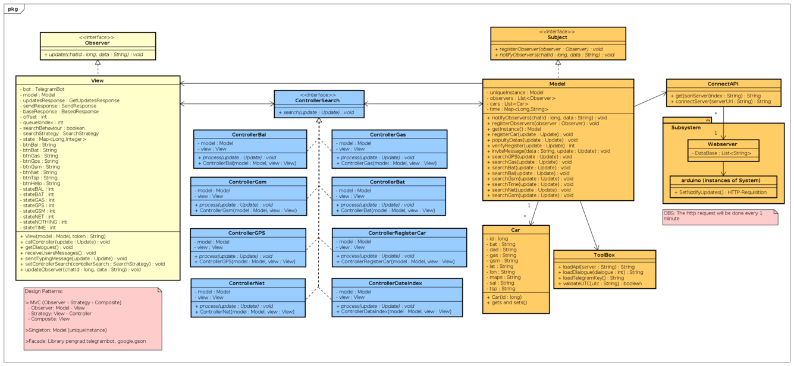

# IntelliJCar-JavaBotMVC :car: :oncoming_automobile:

## Seu Carro na sua mão!

Bot telegram para permitir acesso as informações de seu automóvel ao seu smartphone via bot Telegram;

## Sobre:

Bot criado para fins acadêmicos, para o estudo e aplicação do padrão de arquitetura de software MVC. Proposto como trabalho semestral da disciplina Engenharia de Software III, lecionada pelo Profº Me. Giuliano Bertoti em 2018, na instituição de ensino Fatec Professor Jessen Vidal (São José dos Campos)

## Tecnologias utilizadas

Aplicativo de mensagens Telegram, Linguagem de Programação JAVA (padrão de arquitetura de software MVC) e Python (MicroFramework Flask), microocontrolador Arduino, módulo GSM e RaspberryPI.

## Funcionamento:

- **Logo do sistema:**

- **Tela de Descrição de Funcionamento:**

Primeira interação com o usuário;

- **Tela de Boas vindas:**

Tela que introduz o usuário ao aplicativo;

- **Função GPS:**

Mostra a localização do veículo;

- * **GoogleMaps:**

Ao clicar no link da mensagem do *Função Gps*, o bot encaminha para usuário, a localização de seu veículo via *GoogleMaps*:

- **Bateria:**

Indica ao usuário um valor de 0 a 100 em relação diretamente proporcional a quantidade disponível de **bateria** do veículo;

- **Gasolina:**

Indica ao usuário um valor de 0 a 100 em relação diretamente proporcional a quantidade disponível de **gasolina** do veículo;

- **Franquia restante disponível:**

Indica ao usuário um valor correspondido em MB. a quantidade de franquia usada, e a quantidade de franquia total do respectivo pacote de dados atinente ao sistema (independente da operadora de telefonia, seguirá o mesmo padrão). *QUANTIDADE-GASTA* **|** *QUNATIDADE-TOTAL*

- **Nível de Sinal do Sistema:**

Indica ao usuário um valor de 0 a 100 em relação diretamente proporcional ao nível de área de acesso do módulo GSM do sistema com sua respectiva operadora;

- **Dados em um intervalo de Tempo:**

Ao indicar um intervalo de tempo entre dois horários separados por um traço "**-**" (HHMM-HHMM), retornará para o usuário um link com todos pontos minuto a minuto de tal intervalo, e ao clicar nos pontos, terá em impresso na tela (*pop-up*) contendo todos os dados do veículo naquele respectivo momento.

# Diagrama de Classes do Sistema:

## Referências:

Documentação da API de acesso ao telegram:

- https://github.com/pengrad/java-telegram-bot-api

Programações Auxiliares:

- https://github.com/giulianobe
