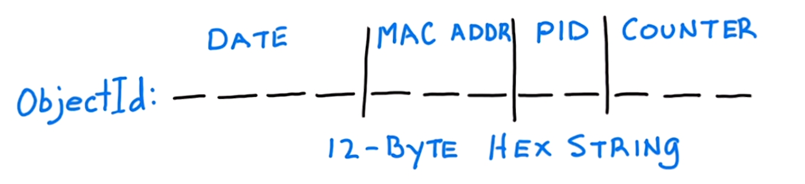

## Sobre :speech_balloon:

Material transcrito na intenção de auxiliar o apredizado dos materias do curso [*MongoDB University*](https://university.mongodb.com).


# CRUD

## CREATE

**Observação:** Antes de começar a estudar os comandod e inserção, vamos estudar um pouco sobre a Estrutura de um documento em mongoDB:

* Cada documento mecessita apenas de um campo obrigatório, que é o **_id**, responsável ser o identificador único em uma coleção. 

* Na criação de um documento, ele é criado automaticamente com um identificador único em hexadecimal.

* Pode-se sobrescrever o valor de **_id**, desde que ele seja único em uma determinada coleção.

Há diversas maneiras de se criar uma coleção no mongoDB, abordaremos de momento as principais:

COMANDO		|	DESCRIÇÃO
----------------|----------------
insertOne	|	Insere apenas um documento
insertMany	|	Insere vários documentos de uma vez


### insertOne

O comando ```insertOne``` faz a inserção de apenas um documento por chamada, segue o exemplo abordando a explicação da *Estrutura de um documento em mongoDB*

Inserindo um documento:

```shell_script
db.sites.insertOne( 
    { 
        "name" : "facebook" 
    } 
)
```
 
Inserindo um documento, sobrescrevendo ID:

```
db.sites.insertOne( 
    { 
        "_id" : "valor_qualquer", 
        "name" : "facebook" 
    } 
)
```

Inserindo outro documento, com o mesmo ```name : "facebook```, neste caso, quando não se sobrescreve o ID, é inserido outro documento com os mesmos valores. **Não é permitido dois documentos com mesmo ID**. 

```
db.sites.insertOne( 
    { 
        "name" : "facebook" 
    } 
)
```

Visualizando os documentos de maneira organizada com ```.find().pretty()```

```
[IN]  db.sites.find().pretty()

[OUT]
{   
    "_id" : ObjectId("5b79c40518fa765e4f661323"), 
    "name" : "facebook" 
},
{ 
    "_id" : "valor_qualquer", 
    "name" : "facebook" 
},
{ 
    "_id" : ObjectId("5b79c44218fa765e4f661324"), 
    "name" : "facebook" 
}
```


### insertMany: 

`insertMany` é usado quando há necessidade de inserir vários documentos de uma vez. Para inserir os documentos, os mesmos devem estar contidos em um array. Há duas maneiras de se inserir os documentos:

**Ordenada:** Insere os documentos de maneira ordenada (seguindo a ordem que foi descito na chamada desta função),  caso encontre um identificador duplicado, as inserções são interrompidas, e é salvo todos documentos até o momento do documento que detém o indentificador duplicado. 

**Desordenada:** Insere os documentos de maneira desordenada,  caso encontre um identificador duplicado, é ignorado a sua inserção, e as inserções prosseguem (insere todos o elementos, menos os com o _id e insere apenas um dos elementos que tem o _id repetido).

Para declarar que as inserções serão feitas de maneira desordenada, há de declarar a chamada da função desta forma: 

```
db.moviesScratch.insertMany(
    [ 
        ... *documentos* ... 
    ],
    {
        "ordered": false 
    }
)
```

## Exemplo prático do insertMany Ordenado

No exemplo abaixo, será salvo apenas os dois primeiros elementos, uma vez que o terceiro elemento tem o _id igual do terceiro elemento ("_id" : "tt0084726")

```
db.moviesScratch.insertMany(
    [
        
        {
            "_id" : "tt0084726",
            "title" : "Star Trek II: The Wrath of Khan",
            "year" : 1982,
            "type" : "movie"
        },
        {
            "_id" : "tt0796366",
            "title" : "Star Trek",
            "year" : 2009,
            "type" : "movie"
        },
        {
            "_id" : "tt0084726",
            "title" : "Star Trek II: The Wrath of Khan",
            "year" : 1982,
            "type" : "movie"
        },
        {
            "_id" : "tt1408101",
            "title" : "Star Trek Into Darkness",
            "year" : 2013,
            "type" : "movie"
        },
        {
            "_id" : "tt0117731",
            "title" : "Star Trek: First Contact",
            "year" : 1996,
            "type" : "movie"
        }
    ]
);
```

## Exemplo prático do insertMany Desordenado

Neste exemplo, será inserido todos os documentos, menos o terceiro elemento que detém o _id igual do primeiro elemento ("_id" : "tt0084726")

```
db.moviesScratch.insertMany(
    [
        {
	    "_id" : "tt0084726",
	    "title" : "Star Trek II: The Wrath of Khan",
	    "year" : 1982,
	    "type" : "movie"
        },
        {
	    "_id" : "tt0796366",
	    "title" : "Star Trek",
	    "year" : 2009,
	    "type" : "movie"
        },
        {
	    "_id" : "tt0084726",
	    "title" : "Star Trek II: The Wrath of Khan",
	    "year" : 1982,
	    "type" : "movie"
        },
        {
	    "_id" : "tt1408101",
	    "title" : "Star Trek Into Darkness",
	    "year" : 2013,
	    "type" : "movie"
        },
        {
	    "_id" : "tt0117731",
	    "title" : "Star Trek: First Contact",
	    "year" : 1996,
	    "type" : "movie"
        }
    ],
    {
        "ordered": false 
    }
);
```

# ObjectId



O ObjectId, tem em sí uma regra muito eficaz de manter a unicidade de um documento, ele é composto por por 12 bytes descritos em base hexadecimal.

* Os primeiros 4 bytes são reservados para representar a data de criação do documento (faz referência a um datetime UTC com uma precisão de segundos (não dias));

* O 5º, 6º e 7º bytes é a representação do MAC-Address da máquina que efetou a insersão do documento;

* 8º e 9º byte. é a representação do PID, número de processo do sistema operacional no momento que efetou a inserção do documento;

* O 10º, 11º, e 12º byte, é a representação de um contador/diferenciador de documentos, que atendem todas as três regras anteriores descritas.


# READ

Iremos ver as pesquisas de **igualdade/equivalência** envolvendo:

* Valores de campos escalares (*scalars*);
* Documentos aninhados (*Embedded Documents*);
* Matriz (*Arrays*).

## Valores de campos escalares:

Dada a coleção movieDetails, para verificar a quantidade de documentos (rated : "PG-13") fazemos:

```
db.movieDetails.find(
    {
        rated : "PG-13"
    }
).count()
```

O shell irá retornar **152**. Agora se quisermos adiconar mais características a pesquisa, basta adicionar outros campos na pesquisas

```
db.movieDetails.find(
    {
        rated : "PG-13",
        year : 2009
    }
).count()
```

O shell irá retornar **8**, pois pesquisou como parâmetro duas condições.

## Pesquisas Aninhadas:

Para pesquisar um dado aninhado, ou seja, pesquisar um documento dentro de um documento, usamos *dot notation*, que nada mais é indicar o dado de forma hierárquica com ponto.

Exemplo: Para pesquisar o dado "meter" igual a 100, em que "meter" é pertencente ao documento "tomato" que é pertencente a um documento qualquer da coleção, faremos:

```
db.movieDetails.find(
    {
        "tomato.meter" : 100
    }
)
```

Retorno do mongoShell:

```
{
    "_id" : ObjectId("5692a15524de1e0ce2dfcfa3"),
    "title" : "Toy Story 3",
    "tomato" : {
        "meter" : 99,
        "image" : "certified",
        "rating" : 8.9,
        "reviews" : 287,
        "fresh" : 283,
        "consensus" : "Deftly blending comedy, adventure, and honest emotion, Toy Story 3 is a rare second sequel that really works.",
        "userMeter" : 89,
        "userRating" : 4.3,
        "userReviews" : 602138
    }
}
```

## Pesquisas em Matriz (array):

Dada estrutura de documento:

```
{
    "_id" : ObjectId("5692a15524de1e0ce2dfcfa3"),
    "title" : "Toy Story 3",
    "year" : 2010,
    "rated" : "G",
    "released" : ISODate("2010-06-18T04:00:00Z"),
    "runtime" : 103,
    "countries" : [
        "USA"
    ],
    "genres" : [
        "Animation",
        "Adventure",
        "Comedy"
    ],
    "director" : "Lee Unkrich",
    "writers" : [
        "John Lasseter",
        "Andrew Stanton",
        "Lee Unkrich",
        "Michael Arndt"
    ]
}
```

Para pesquisar dois "writters" de uma vez, devemos fazer (**a ordem dos elementos importa**):

```
db.movieDetails.find(
    {
        "writters" : [
            "Ethan Coen",
            "Joel Coen"
        ]
    }
)
```

Para pesquisar um elemento de uma matriz, a partir de seu índice devemos:

```
db.movieDetails.find(
    {
        "actos.0" : [
            "Ethan Coen"
        ]
    }
)
```

## Cursors 

O método **find** retorna um cursor, se não atribuirmos o retorno de uma chamada *find* a uma variável, ele vai imprimir no console, os 20 primeiros elementos, ou seja, os dados são retornados em lotes (*batch*). 

O primeiro lote para maioria das consultas, retorna 101 elementos, ou até exceder o limite de 1 MB. Os lotes subsequentes terão o tamanho de 4 MB(valores de lotes configuráveis).

```
var c = db.movieDetails.find();
var doc = function() { return c.hasNext() ? c.next() : null }

[IN] c.objsLeftInBatch();

[OUT] 101

[IN] doc();

[IN] doc();

[IN] doc();

[IN] doc();

[IN] c.objsLeftInBatch();

[OUT] 97
```

## Projections

Servem para limitar as saídas, afim de reduzir a sobrecarga e o processamento na rede. As projeções são inseridas como segundo parâmetro para função *find*

```
db.movieDetails.find(
    {
        rated : "PG"
    },
    {
        title : 1
    }
)
```

Esta chamada irá retornar todos os elementos apenas com o seu respectivo "title" e por padrão com seu respectivo *_id*. 

Para retornar somente os elementos apenas com o seu respectivo "title", será necessário negativar o retorno *_id* da seguinte maneira:

```
db.movieDetails.find(
    {
        rated : "PG"
    },
    {
        title : 1,
        _id: 0
    }
)
```

Se quisermos retornar dados por exclusão, devemos apenas negativar o que não deseja ser exposto.

```
db.movieDetails.find(
    {
        rated : "PG"
    },
    {
        title : 0,
        _id: 0
    }
)
```

Esta chamada irá retornar todos os elementos com o seus respectivos campos com exceção de *title* e *_id*. 


# Operadores lógicos:

São operadores que permitem fazer consultas mais refinadas, do que apenas consulta de correnpondência de igualdade de um respectivo campo de um documento. De forma objetiva, para utilizarmos operadores lógicos, **devemos explicitar os argumentos de busca em um formato JSON** 

## Exemplo 01

```
db.collection.find(
    { 
        field: { $gt: 90 } //Argumento de busca
    }
)
```

O argumento de busca é: **valores maiores que 90**, para codificar este argumente de busca, devemos formatar no formato JSON, onde $gt indica "valores maiores", e 90 é o valor.


## Exemplo 02

Pode-se adicionar outros argumentos para uma determinada busca. O argumento de busca no caso abaixo  é: 

* **valores maiores que 95** para o campo "tomato.meter";
* **valores maiores que 180** para o campo runtime.

Os respectivos argumentos de busca codificados ficarão assim:

```
db.movieDetails.find(
    { 
        "tomato.meter": { $gte: 95 }, 
        runtime: { $gt: 180 } 
    }
)
```

## Exemplo prático:

Dada uma coleção de filmes, temos:

Retorna os elementos que possui tempo de duração maior que 90;

``` 
db.movieDetails.find(
    { 
        runtime: { $gt: 90 } 
    }
).count()
```

Podemos verificar por intervalo, assim como no exemplo acima, em que { $gt: 90, $lt: 120 } são condições compostas para delimitar um intervalo de maior que 90 e menor que 120;

```
db.movieDetails.find(
    { 
        runtime: { $gt: 90, $lt: 120 }
    }
).count()
```

Podemos adicionar mais parâmetros de busca, apenas devemos isola-los com **,** (virgulas);

```
db.movieDetails.find(
    { 
        "tomato.meter": { $gte: 95 }, 
        runtime: { $gt: 180 } 
    }
)
```

Podemos utlizar comando de exceção como argumento de busca, neste caso retorna todos elementos NÂO IGUAIS *Not Equals* a "UNRATED";

```
db.movieDetails.find(
    { 
        rated: { $ne: "UNRATED" } 
    }
).count()
```

É possivel adicionar argumentos de busca de **inclusão**, o exmplo acima retorna todos os elementos que possui o campo "rated" com o valor "G" ou "PG". Neste caso o resultado foi retornado com uma projeção, isso é percepitivel pela adição do segundo parâmetro na função find()

```
db.movieDetails.find(
    { 
        rated: { $in: ["G", "PG"] }
    },
    {
        title : 1,
        runtime : 1,
        _id : 0
    }
).pretty()
```

## Operadores *type* e *exists*:

* **type:** Serve para verificar o tipo de dado em que o campo mantem;
* **exists:** Serve para verificar a existência de um campo em determinada collection.

## Exemplo prático *exists:* :

No exemplo abaixo, a chamada da função find() com os determinados argumentos/paramêtros de busca irá retornar apenas os documentos da coleção *moviesDetails* que contenha o campo (*field*) "tomato.meter".  

```
db.moviesDetails.find(
    { 
        "tomato.meter": { $exists: true } 
    }
)
```

O mesmo esquema se aplicaria para retornar os documentos que não contém um respectivo campo, para isso, indicariamos { $exists: false }, como parametro de busca.

```
db.moviesDetails.find(
    { 
        "tomato.meter": { $exists: false }
    }
)
```

## Exemplo prático *type:* :

Dado uma coleção onde os há diversos documentos, onde metade destes detem seu *_id* sobrescrito com uma string qualquer, a chamada da função find() com os determinados argumentos/paramêtros de busca irá retornar apenas a metade dos documentos da coleção *moviesDetails* que tem os *_id* sobrescrito com um valor do tipo *String* 

```
db.moviesScratch.find(
    { 
        _id: { $type: "string" } 
    }
)
```

* Observação: O valor de $ type pode ser um número do tipo BSON ou o alias da string. Saiba mais em: https://docs.mongodb.org/manual/reference/operator/query/type

# OPERADORES LÓGICOS AND, NOR, NOT, OR

* **or:** 
* **and:** 
* **not:** 
* **nor:** 

## Sintaxe:

De forma objetiva, para utilizarmos operadores lógicos, devemos explicitar primeiro o operador lógico, onde seu valor é composto por um *array* que serão as condições que entrarão na decisão atinente ao operador lógico descrito:

```
db.collection.find(
    {
        $OPERADOR_LOGICO : [ 
            { 
                "CAMPO": "ARGUMENTO DE BUSCA" /* Condição 01 */
            },
            { 
                "CAMPO": "ARGUMENTO DE BUSCA" /* Condição 02 */
            } 
        ] 
    }
)

```

No exemplo abaixo, o operador lógico a ser usado é o $or, em que a função find() retornará os documentos que atendem as condições explicitadas, tal que: Campo "tomato.meter" maior igual a 99 **OU/OR** "metacritic" maior que 95:

```
db.movieDetails.find(
    {
        $or : [ 
                { 
                    "tomato.meter": { $gte: 99 } 
                },
                { 
                    "metacritic": { $gt: 95 } 
                } 
        ] 
    }
)
```

No exemplo abaixo, o operador lógico a ser usado é o $and, em que a função find() retornará os documentos que atendem as condições explicitadas, tal que: Campo "metacritic" exista no documento **E/AND** "metacritic" **Não Igual/*Not Equals***  a que o valor 100:

```
db.movieDetails.find(
    { 
        $and : [ 
            { 
                "metacritic": { $ne: 100 } 
            },
            { 
                "metacritic": { $exists: true }
            } 
        ] 
    }
)
```

# Uso de REGEX:
Também é possivel fazer o uso de expressões regulares como argumento/parâmetro de busca;

Neste exemplo temos um regex que indica se no campo "awards.text" contém a palavra *Won*.

```
db.movieDetails.find(
    { 
        "awards.text": { $regex: /^Won.*/ } 
    }
).pretty()
```

Este exemplo segue a lógica do exemplo anterior, porém este adiciona um segundo parâmetro na chamada da função find(). criando uma projeção, em que a mesma limitará a saída dos documentos que atendam o regex por "title" e "awards".

```
db.movieDetails.find(
    { 
        "awards.text": { $regex: /^Won.*/ } 
    },
    { 
        title: 1, 
        "awards": 1, 
        _id: 0
    }
).pretty()
```

# OPERADORES COM ARRAY:

* **$all:** Retorna os documentos que contém os elementos indicados em um array;
* **$size:** Disponibiliza como item de pesquisa, o tamanho de um de um campo que tem como valor um array;
* **$elemMatch:** Indica como parametro de busca, dois ou mais parametros/argumentos em **um mesmo** documento.

Dada um conjunto de documentos:

```
boxOffice: [ 
    { "country": "USA", "revenue": 41.3 },
    { "country": "Australia", "revenue": 2.9 },
    { "country": "UK", "revenue": 10.1 },
    { "country": "Germany", "revenue": 4.3 },
    { "country": "France", "revenue": 3.5 }
]
```

No caso abaixo, $all fará que traga **todos** os documentos que possuam "Comedy", "Crime", "Drama" em sua composição no campo "genres" 

```
db.movieDetails.find(
    { 
        genres: { $all: 
            [
                "Comedy", 
                "Crime", 
                "Drama"
            ] 
        } 
    }
).pretty()
```

No caso abaixo, $size fará que traga os documentos que possuam possuam apenas **1** elemento na composição do campo "countries" 

```
db.movieDetails.find(
    { 
        countries: { $size: 1 } 
    }
).pretty()
```

Se tentarmos resgatar um documento de um array com dois ou mais argumentos de busca não podemos fazer o caso abaixo, porque assim, estaremos retornando elementos que tenham *country: "UK"* e que tenham *revenue: { $gt: 15 }*.

```
db.movieDetails.find(
    { 
        boxOffice: { 
            country: "UK", 
            revenue: { $gt: 15 } 
        } 
    }
)
```

**$elemMatch:** Concatena dois argumentos de busca a um unico objeto, isso corrige o caso acima. Desta forma estamos buscando um documento que tenha *country: "UK"* **e** *revenue: { $gt: 15 }* 

```
db.movieDetails.find(
    { 
        boxOffice: {
            $elemMatch: { 
                country: "UK", 
                revenue: { $gt: 15 } 
            } 
        } 
    }
)
```

# UPDATE

Existem três maneiras de atualizar os documentos

* **UpdateOne:** Atualiza o primeiro documento recuperado pelo banco que se enquadram no parâmetro de busca (filtro seletor);
* **UpdateMany:** Atualiza todos os documentos recuperados pelo banco que se enquadram no parâmetro de busca (filtro seletor);
* **ReplaceOne:** Atualiza os campos de um documento inteiro.

```replaceOne()``` você só pode substituir o documento inteiro
```updateOne()``` permite atualizar os campos que você anotou na pergunta.

Procura o documento que detém ```title: "The Martian"```, e o primeiro que achar, atualiza o campo ```poster``` 

```
db.movieDetails.updateOne(
    {
        title: "The Martian"
    }, 
    {
        $set: {
            poster: "http://ia.media-imdb.com/images/M/MV5BMTc2MTQ3MDA1Nl5BMl5BanBnXkFtZTgwODA3OTI4NjE@._V1_SX300.jpg"
        }
    }
)
```

## Operadores:


Nome                | Descrição
--------------------|----------------
**$currentDate**	| Define o valor de um campo para a data atual, como Data ou Timestamp.
**$inc**	        | Incrementa o valor do campo pelo valor especificado.
**$min**        	| Apenas atualiza o campo se o valor especificado for menor que o valor do campo existente.
**$max**	        | Somente atualiza o campo se o valor especificado for maior que o valor do campo existente.
**$mul**	        | Multiplica o valor do campo pelo valor especificado.
**$rename**	        | Renomeia um campo.
**$set**	        | Define o valor de um campo em um documento.
**$setOnInsert**	| Define o valor de um campo se uma atualização resultar em uma inserção de um documento. Não tem efeito nas operações de atualização que modificam os documentos existentes.
**$unset**	        | Remove o campo especificado de um documento.

Incrementando campos no array "tomato"

```
db.movieDetails.updateOne(
    {
        title: "The Martian"
    }, 
    {
        $inc: {
            "tomato.reviews": 3,
            "tomato.userReviews": 25
        }
    }
)
```

Neste caso, queremos deixar apenas os últimos 5 posts, então para isso devemos utilizar o **$push** para inserir os dados contidos no array diante o **$each**, e delimitar a referência inicial do array a ser preservada com o **$position**, e limitar o a quantidade máxima de elementos com **$slice**

```
db.movieDetails.updateOne(
    {
        title: "The Martian"
    }, 
    {
        $push: {
            reviews: {
                $each: [
                    {
                        rating: 0.5,
                        date: ISODate("2016-01-13T07:00:00Z"),
                        reviewer: "Shannon B.",
                        text: "Enjoyed watching with my kids!"
                    }
                ],
                $position: 0,
                $slice: 5
            }
        }
    }
)
```

* **updateMany:** *(Utilizando $set)*  Atualizará todos os documentos que possuam "rated = null"

```
db.movieDetails.updateMany(
    {
        rated : null
    },
    {
        $set : {
            rated : "UNRATED"
        }
    }
)
```

### **updateMany:** *(Utilizando $unset)*  

Atualizará todos os documentos que possuam "rated = null"

```
db.movieDetails.updateMany(
    {
        rated : null
    },
    {
        $unset : {
            rated : ""
        }
    }
)
```

### Upserts
Upserts é um paramêtro nos comandos de *update* que servem para indicar a criação de um campo caso ele não exista no ato de um *update*

Atualizará os documentos que possuam o campo ```imdb.id``` igual ao campo ```detail.imdb.id```. O terceiro parâmetro, indica a criação caso a inexistência do campo indicado no primeiro parâmetro:

```
db.movieDetails.updateOne(
    {
        "imdb.id" : detail.imdb.id
    },
    {
        $set : detail
    },
    {
        upsert : true
    }
)
```