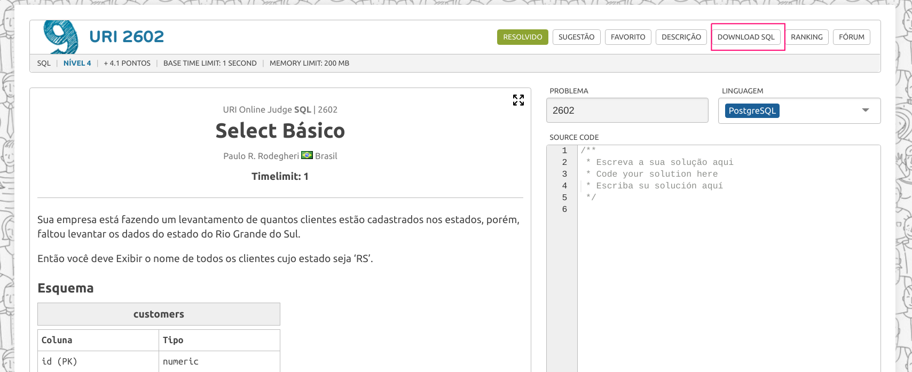
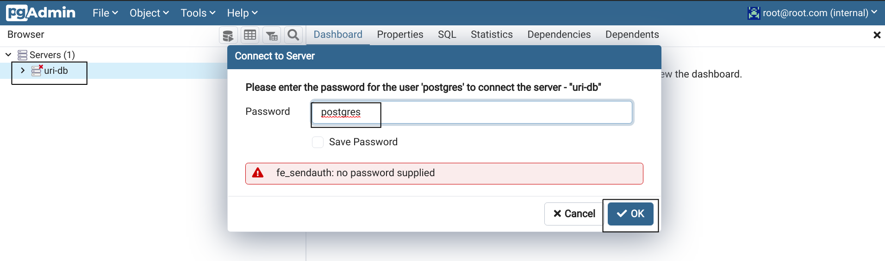
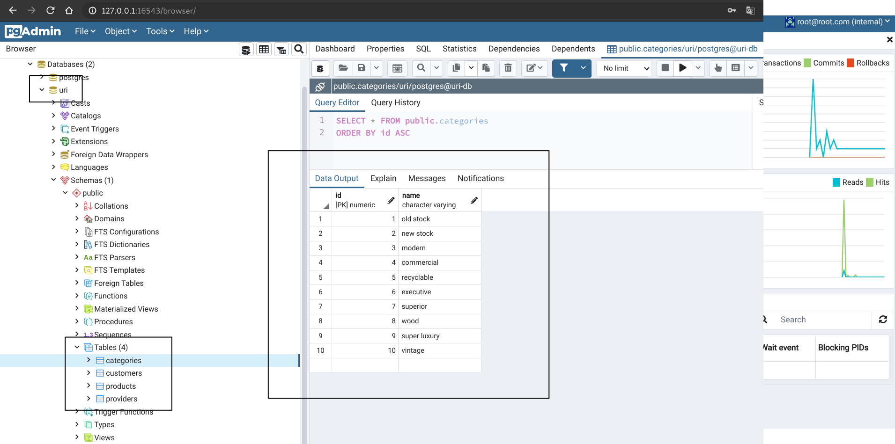

# uri-postgresql-docker-provisioning

- __Date__: 02/11/2020
- __Author__: [@augustoliks](https://github.com/augustoliks) | <carlos.santos110@fatec.sp.gov.br>
- __Description__: Docker environment with PostrgreSQL and Pgadmin, created for tests SQL of URI Judge Online Plataform.
- __Objective__: Provides Facility on tests URI's execercicies and familiarity on real PostgreSQL environment. 

- __Actual Features__:

    - PgAdmin and PostgreSQL Dockerized;
    - SQL scripts run automatically on compose boot or running [update.sh](./update.sh) script. 

## Project Structure

```shell
├── db-config                               # Provisioning database and visualization
│   ├── pgadmin 
│   │   ├── passfile                        # Provisioning direct access on database "uri"
│   │   └── servers.json                    # Provisioning conection and visualization on database "uri"
│   └── postgres
│       └── docker-entrypoint-initdb.d      # Directory bind docker volume. Provisioning databases;
│           └── init-db.sh                  # Script for execute sql's inside "sql" in this project directory. Execute on "uri-db" container boot and "update.sh" script
├── docker-compose.yaml                     # Compose postgres and pgadmin 
├── README.md                           
├── sql                                     # SQL's scripts, donwloaded on URI Judge Online Plataform.
│   ├── 2602.sql                            
│   └── 2605.sql
└── update.sh
```

## How to Run 

```shell
docker-compose up -d
```

## Update Databases

```shell
./update.sh
```

## Access 

- Download SQL on URI Judge Online Plataform.



---

- Save in [sql](./sql) directory.


- Access http://127.0.0.1:16543. Credentials definited on [docker-compose.yml](./docker-compose.yml)


> - username: __root@root.com__
> - password: __root__

---

- Auth on database;



--- 

- Verify databases;



